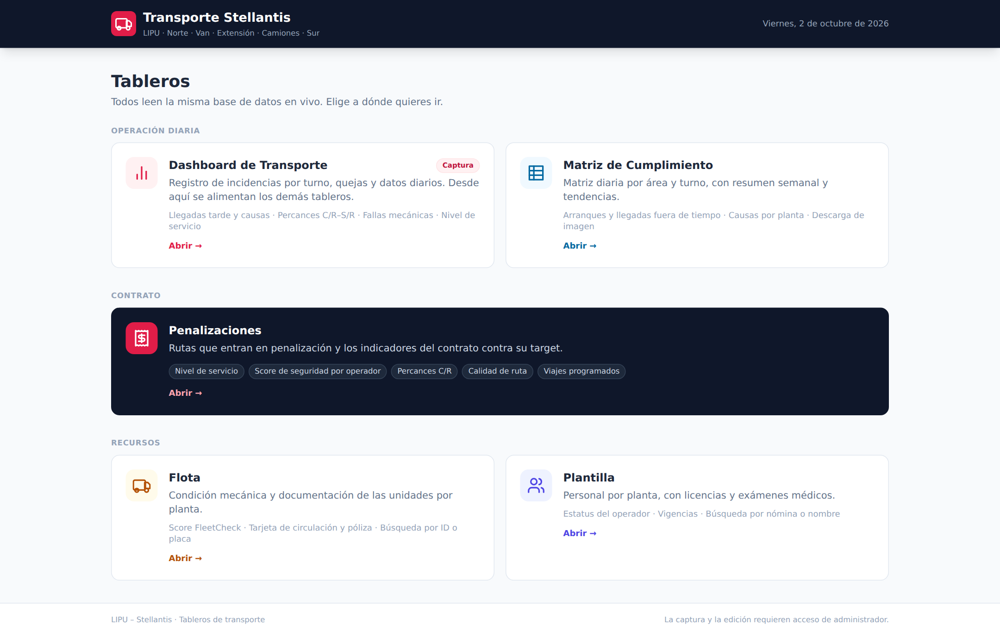
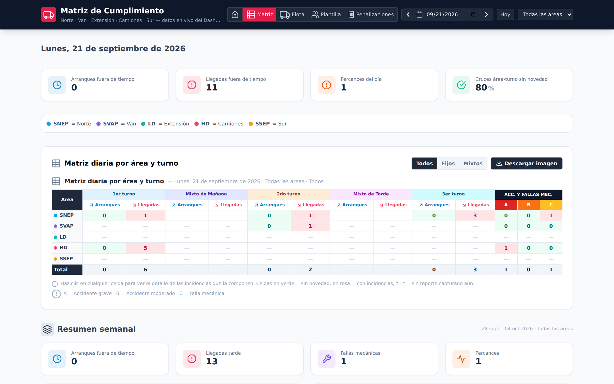
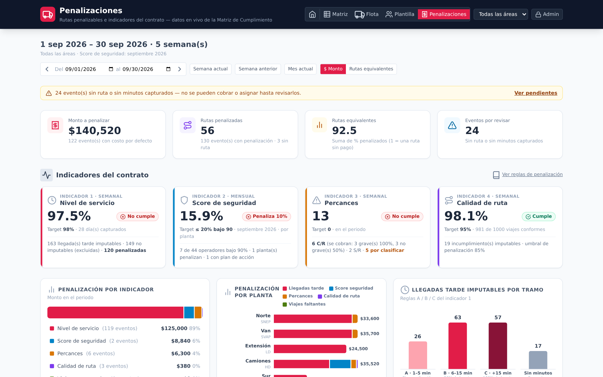
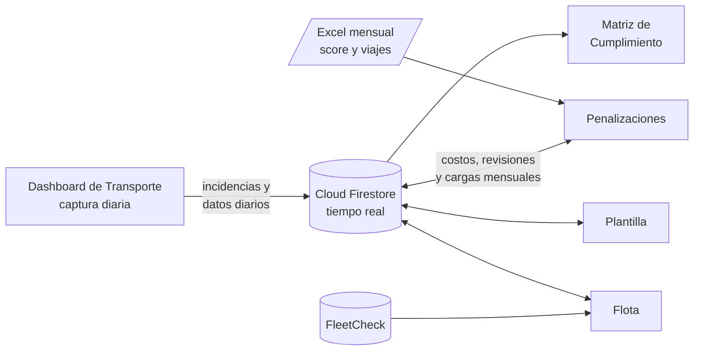

<div align="center">

# Tableros de Transporte · Stellantis

**Control operativo y contractual del servicio de transporte de personal LIPU – Stellantis**

Captura de incidencias, cumplimiento por área y turno, penalizaciones del contrato, flota y plantilla, conectados a una sola base de datos en tiempo real.


<br>



</div>

---

## Contenido

- [Descripción](#descripción)
- [Tableros](#tableros)
- [Capturas](#capturas)
- [Arquitectura](#arquitectura)
- [Reglas de penalización](#reglas-de-penalización)
- [Cargas mensuales de Excel](#cargas-mensuales-de-excel)
- [Publicación](#publicación)
- [Estructura del repositorio](#estructura-del-repositorio)
- [Modelo de datos](#modelo-de-datos)
- [Consideraciones de seguridad](#consideraciones-de-seguridad)

---

## Descripción

El proyecto concentra en un solo sitio la operación diaria del transporte de personal para las cinco plantas de Stellantis Saltillo:

| Código | Planta |
|:------:|--------|
| **SNEP** | Motores Norte |
| **SVAP** | Van |
| **LD** | Extensión |
| **HD** | Camiones |
| **SSEP** | Motores Sur |

Cada incidencia se captura una sola vez y alimenta automáticamente la matriz de cumplimiento, los indicadores del contrato y el cálculo de penalizaciones por ruta.

---

## Tableros

| Tablero | Archivo | Para qué sirve |
|---------|---------|----------------|
| **Inicio** | `index.html` | Punto de entrada con acceso a todos los tableros. |
| **Dashboard de Transporte** | `Stellantis_2.html` | Captura de incidencias por turno (llegadas tarde y causas, percances C/R–S/R, fallas mecánicas con ruta y unidad), quejas y datos diarios. Botón *Rellenar vacíos con 0*. |
| **Matriz de Cumplimiento** | `Matriz_Cumplimiento_Transporte.html` | Matriz diaria por área y turno (fijos y mixtos), resumen semanal con gráficas por planta y causas, tendencias semanales y mensuales con rango de fechas, y descarga de la matriz como imagen. |
| **Penalizaciones** | `Penalizaciones_Stellantis.html` | Rutas que entran en penalización, indicadores del contrato contra su target, semáforo por planta, catálogo de costos por ruta, revisión de eventos y exportación a CSV. |
| **Flota** | `Flota_Stellantis.html` | Condición mecánica y documentación de unidades (score FleetCheck, tarjeta de circulación, póliza). |
| **Plantilla** | `Plantilla_Stellantis.html` | Personal por planta con vigencia de licencias y exámenes médicos. |

Todos los tableros comparten el mismo encabezado de navegación, el mismo filtro por planta y el mismo estilo visual.

---

## Capturas

> Las capturas usan datos de demostración.

**Matriz de Cumplimiento**



**Penalizaciones**



---

## Arquitectura

Cada tablero es un archivo HTML autocontenido: no hay servidor propio ni proceso de compilación. Las páginas leen y escriben directamente en Cloud Firestore y se actualizan en vivo.



**Tecnologías**

| Capa | Herramienta |
|------|-------------|
| Interfaz | React 18 (UMD) + Babel Standalone, JSX en el navegador |
| Estilos | Tailwind CSS (CDN) |
| Datos | Firebase / Cloud Firestore 10.7 (SDK compat), suscripciones en tiempo real |
| Gráficas | SVG propio (barras, líneas, pastel, apiladas) con tooltips |
| Excel | SheetJS 0.18.5 para leer y generar `.xlsx` |
| Imágenes | html2canvas 1.4.1 para exportar la matriz |

---

## Reglas de penalización

El tablero de Penalizaciones aplica las reglas del contrato a cada evento capturado.

| # | Indicador | Target | Periodo | Penalización |
|:-:|-----------|:------:|:-------:|--------------|
| 1 | **Nivel de servicio** | 98% | Semanal | Llegada tarde **imputable**: 1–5 min sin penalización · 6–15 min **50%** · más de 15 min **100%**. Las causas no imputables se excluyen. |
| 2 | **Score de seguridad** | 90% | Mensual | Por planta: si más del 20% de los operadores está bajo 90% → plan de acción. Si se repite el mes siguiente → **10%** del valor mensual de la ruta de cada operador bajo 90%. |
| 3 | **Percances** | 0 | Semanal | Sólo percances **C/R** (con responsabilidad): grave **100%**, no grave **50%**. Los S/R no se cobran. |
| 4 | **Calidad de ruta** | 95% | Semanal | Si la planta queda bajo 85% por causas imputables → **10%** por ruta incumplida. No acumulable. |
| 5 | **Viajes programados** | Por planta | Diario | Cada viaje faltante contra el mínimo del día se cobra al **100%**. No aplica si ese día la ruta ya tiene una llegada tarde penalizada. |

**Cálculo del monto**

```
Valor del viaje = (Costo fijo mensual ÷ Viajes al mes) + (Km por viaje × Costo por km)
Monto           = % de penalización × Valor del viaje
```

- Un mismo viaje (fecha, turno y ruta) nunca se penaliza por más del 100%.
- Las rutas sin costo en el catálogo usan el costo por defecto y se marcan como tal.
- Un administrador puede revisar cualquier evento: corregir ruta, minutos o severidad, clasificar C/R–S/R o descartarlo con una nota.

**Viajes mínimos por día**

| Planta | L–V | Sábado | Domingo | Rutas excluidas |
|--------|:---:|:------:|:-------:|-----------------|
| Camiones | 3 | 2 | 1 | Artesillas, Carneros, Chapula, El Tejocote – Trinidad, Macuyu, San Antonio, San Rafael |
| Extensión | 3 | 2 | 1 | — |
| Motores Norte | 3 | 3 | 3 | — |
| Motores Sur | 3 | 2 | 1 | Agua Nueva, General Cepeda Camión, General Cepeda Rancherías |
| Van | 2 | 2 | — | — |

Estos valores son editables desde el propio tablero (*Regla de viajes*).

---

## Cargas mensuales de Excel

Ambas cargas se hacen desde el tablero de Penalizaciones con sesión de administrador. Volver a subir un mes reemplaza el anterior.

**Score de seguridad por operador**

| Nombre | Planta | Score | Ruta *(opcional)* |
|--------|--------|:-----:|-------------------|
| PÉREZ LÓPEZ JUAN | Camiones | 94.5 | Ruta 8 |

- La planta acepta nombre o sigla (`Camiones` o `HD`, `Norte` o `SNEP`…), sin importar mayúsculas ni acentos.
- El score puede venir de 0 a 100 o como fracción (`0.945`).
- Hay una plantilla descargable desde el tablero.

**Viajes realizados por ruta**

| PLANTA | RUTA | 01/09/2026 | 02/09/2026 | … |
|--------|------|:----------:|:----------:|:-:|
| CAMIONES | BONANZA | 3 | 3 | … |

- Una columna por día del mes; el mes se detecta solo.
- Celda vacía = sin servicio programado (no se penaliza).
- Al cargar, se sugieren como **días inhábiles** los días en que más de la mitad de las rutas quedó incompleta; se pueden ajustar.
- Los nombres de ruta del Excel y de los registros se empatan de forma aproximada; las que no coinciden se asignan una sola vez y la equivalencia queda guardada.

---

## Publicación

El sitio es estático, así que puede publicarse en GitHub Pages sin configuración adicional:

1. Sube los archivos a la raíz de la rama `main`.
2. En **Settings → Pages**, elige *Deploy from a branch* → `main` / `root`.
3. Abre la URL que muestra GitHub; `index.html` es la página de inicio.

> Los enlaces entre tableros usan los nombres de archivo exactos de la tabla de [Tableros](#tableros). Si renombras un archivo, actualiza los encabezados.

Para probar en local basta con un servidor estático:

```bash
python -m http.server 8000
# http://localhost:8000
```

---

## Estructura del repositorio

```
.
├── index.html                            # Inicio
├── Stellantis_2.html                     # Dashboard de Transporte (captura)
├── Matriz_Cumplimiento_Transporte.html   # Matriz de Cumplimiento
├── Penalizaciones_Stellantis.html        # Penalizaciones
├── Flota_Stellantis.html                 # Flota
├── Plantilla_Stellantis.html             # Plantilla
├── docs/
│   └── screenshots/                      # Capturas del README
└── README.md
```

---

## Modelo de datos

Colecciones de Cloud Firestore utilizadas:

| Colección | Escribe | Lee | Contenido |
|-----------|---------|-----|-----------|
| `incidents` | Dashboard de Transporte | Matriz, Penalizaciones, Flota | Reporte por fecha, planta y turno: causas, rutas, minutos, percances y fallas. |
| `daily_metrics` | Dashboard de Transporte | Matriz, Penalizaciones | Nivel de servicio, score e inicios a tiempo por día y planta. |
| `complaints` | Dashboard de Transporte | Dashboard de Transporte | Quejas por ruta. |
| `route_costs` | Penalizaciones | Penalizaciones | Costo fijo mensual, viajes al mes, km y costo por km de cada ruta. |
| `penalty_config` | Penalizaciones | Penalizaciones | Parámetros, regla de viajes y equivalencias de nombres de ruta. |
| `penalty_reviews` | Penalizaciones | Penalizaciones | Revisiones de eventos (correcciones y descartes). |
| `safety_scores` | Penalizaciones | Penalizaciones | Score por operador, un documento por mes (`AAAA-MM`). |
| `route_trips` | Penalizaciones | Penalizaciones | Viajes realizados por ruta y día, un documento por mes. |
| `plantilla_stellantis` | Plantilla | Plantilla | Personal, licencias y exámenes médicos. |
| `fleet_vehicles` | Flota | Flota | Unidades y documentación. |

---

## Consideraciones de seguridad

- La configuración web de Firebase incluida en los archivos es pública por diseño; la protección real de los datos depende de las **reglas de seguridad de Firestore**. Revisa que sólo permitan las lecturas y escrituras necesarias.
- El acceso de administrador de los tableros es un control de interfaz, no una autenticación. Si el repositorio es público, considera hacerlo **privado** o migrar a Firebase Authentication.
- El tablero de Plantilla contiene datos del personal; evalúa su exposición antes de publicar el sitio.

---

<div align="center">

**LIPU – Stellantis** · Uso interno

</div>
